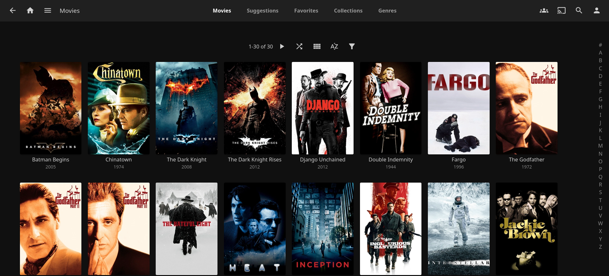
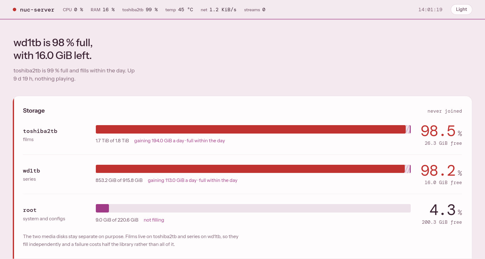

# Homelab

An Intel NUC that downloads, organises and streams a film and series library,
plus a dashboard I wrote to watch the machine. Nine Docker containers, two hard
drives, and a Cloudflare Tunnel that makes two services reachable from outside
without opening a port on the router.

This repository is a case study, not a deployment. Most of the work is
configuration inside web interfaces, so the explanations and screenshots are
the main content, and the files are reference copies taken from the server.

## What runs on it

| Service | What it does |
|---|---|
| SABnzbd | Downloads from Usenet |
| Prowlarr | Holds the indexer and shares it with Radarr and Sonarr |
| Radarr | Finds, scores and imports films |
| Sonarr | Finds, scores and imports series |
| Recyclarr | Writes the scoring model into Radarr and Sonarr once a day |
| Bazarr | Fetches English subtitles |
| Jellyfin | Streams the library, with hardware transcoding on the Intel iGPU |
| cloudflared | Connects the server to Cloudflare Tunnel |
| dashboard | Shows the health of the host, the disks and Jellyfin |

A title is added in Radarr or Sonarr. Everything after that happens on its own:
the best release is chosen, downloaded, unpacked, moved to the right disk,
given a subtitle and shown in Jellyfin. No step waits for a scheduled library
scan.

The final library was 117 films and 10 series with 302 episodes. Both media
drives are full, so the library rotates rather than grows.

## The machine

| Part | Detail |
|---|---|
| Machine | ASUS NUC13ANH-B, Intel Core i3-1315U, 15 GiB RAM |
| System disk | 238 GB NVMe for the OS, all container config and download scratch space |
| Media disks | Toshiba 1.8 TB for films, WD 932 GB for series, in a USB dock |
| OS | Debian 13 with Docker Compose |

The two media drives are never joined. Films live on one and series on the
other, so a failed drive takes only half the library.

## How it is reached from outside

Nothing is open on the router. `cloudflared` makes an outbound connection to
Cloudflare, and the tunnel routes two hostnames to two containers. Every other
hostname gets a 404.

| Service | Protection | Why |
|---|---|---|
| Jellyfin | Jellyfin's own accounts, lockout after 3 failed logins, admin account LAN only | TV and phone apps cannot pass a browser login page |
| Dashboard | Cloudflare Access with a one-time PIN to one email, plus a token check in the app | It is a web page only, and it shows details about the host |

Radarr, Sonarr, Prowlarr, SABnzbd and Bazarr are reachable on the LAN only. SSH
is LAN only, key only.

The top of the dashboard. It opens with one sentence about the worst current
problem, here that both media drives are almost full, followed by a bar per
disk.

## Repository

| Folder | Contents |
|---|---|
| [`media-server/`](media-server/) | Every relevant setting in SABnzbd, Prowlarr, Radarr, Sonarr, Recyclarr, Bazarr and Jellyfin, with screenshots and the reason for each |
| [`host/`](host/) | Hardware, disks, and the scripts and systemd units that run outside Docker |
| [`dashboard/`](dashboard/) | The monitoring dashboard: what each section shows, how it reads the host, and the full source |
| [`docker-compose.yml`](docker-compose.yml) | All nine services |
| [`.env.example`](.env.example) | The variables the stack needs, without values |

No secrets, no media and no service databases are included.
