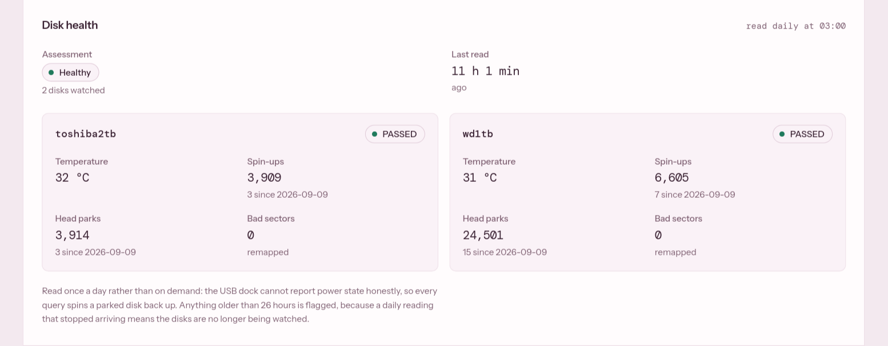
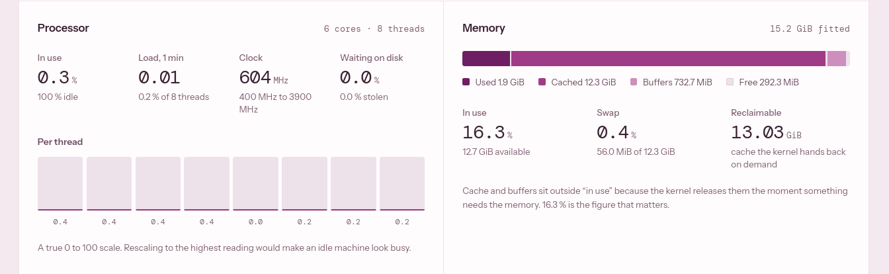
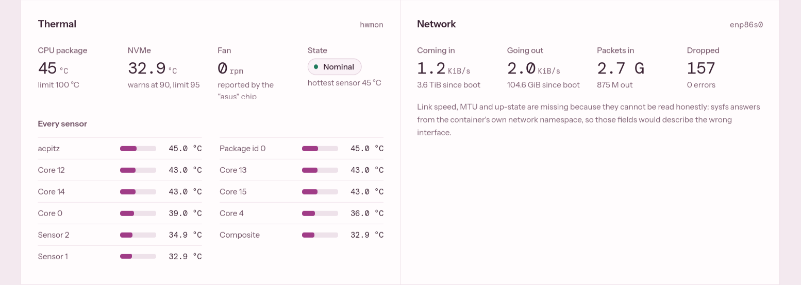
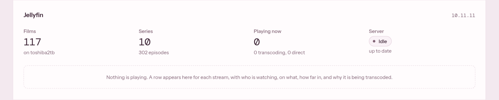
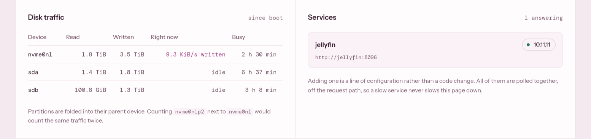
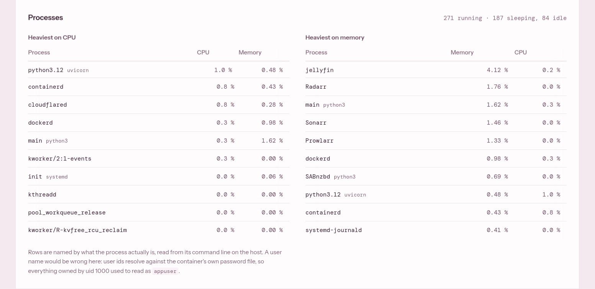
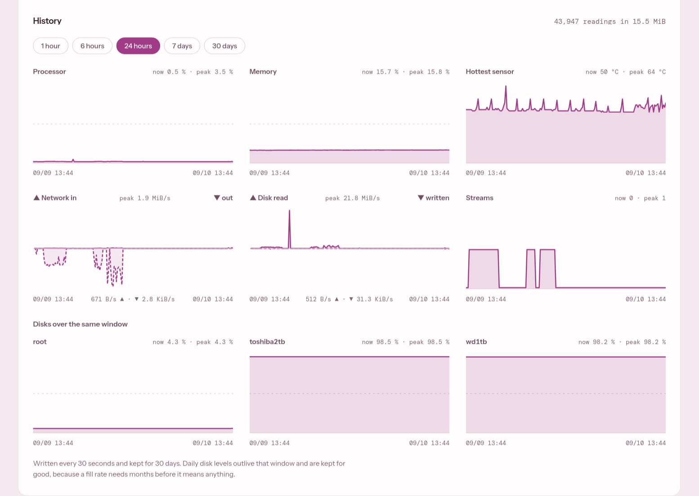

# Dashboard

A monitoring page for the server, written from scratch. FastAPI reads the host
and Jellyfin, and a React page shows the result. Both ship as one container.

It exists so the server can be checked from a phone without a VPN and without a
terminal. It only reads. Nothing on the page can change the machine.


## The page, section by section

The page opens with a sentence instead of a grid of numbers. Every possible
problem is ranked, and the worst one is written out. In the screenshot that is
"wd1tb is 98 % full, with 16.0 GiB left." When nothing is wrong, it says so.

The rail at the top stays in place while scrolling and repeats the key figures:
CPU, RAM, the fullest disk, the hottest sensor, network and active streams. The
line under the rail moves once per poll, so a page that has stopped updating
also stops moving.

The sections follow the order in which things run out on this machine. The
live sections refresh every 5 seconds.

### Storage

Shown in the image above. One bar per disk: the two media drives and the NVMe
root. Each bar has a hatched extension that shows where the disk will be in 7
days, based on the daily fill levels the server has recorded. It appears only
for a disk that is growing. It is the one thing on the page that a single
reading cannot tell you.

A section gets a coloured edge only while something in it is wrong. Here both
media disks are above 98 percent, so Storage is marked red.

### Disk health



The daily SMART reading for both drives: health, temperature, spin-ups, head
parks and reallocated sectors. It comes from the file the host writes at 03:00,
never from the drives. Asking a drive for SMART data wakes it, and this page
polls every 5 seconds.

Spin-ups is the figure to watch. It is a lifetime counter, so the page shows
the change since the previous day next to it. On this hardware that difference
is the only reliable way to see a parked drive waking up. A reading older than
26 hours turns the section red, because it means nothing is watching the
drives.

### Processor and memory



Processor: total load, load average, clock speed, time waiting on disk, and one
bar per thread on a fixed 0 to 100 scale. Rescaling to the highest value would
make an idle machine look busy.

Memory: used, cached, buffers and free, with swap and reclaimable memory. Cache
is shown outside "in use", because the kernel gives it back the moment something
needs it.

### Thermal and network



Thermal: CPU package, NVMe, fan speed, and every sensor sorted from hottest.
Network: current throughput in and out, totals since boot, packets and drops on
the host interface.

Link speed and MTU are missing on purpose. A container can only read those for
its own network namespace, so any value shown would describe the wrong
interface.

### Jellyfin



Library counts, the server version, and one row per active stream: who is
watching what, how far in, and whether it is direct play. When a stream is
transcoded, the row names the reason Jellyfin gives, which on this stack is
usually the audio, not the video.

### Disk traffic and services



Disk traffic: bytes read and written per block device since boot, the current
rate, and busy time. Partitions are folded into their disk so the same traffic
is not counted twice.

Services: one row per polled service with its version and whether it answered.
Adding a service is one line of configuration. All services are polled in
parallel, each with its own timeout, and the result is cached for 30 seconds.

### Processes



The same host process list sorted two ways: by CPU and by memory. The program
using the most CPU is rarely the one holding the most memory.

Rows are named from each process's command line on the host, which turns
`python3` into `SABnzbd`. A user name would be wrong here. Inside the container,
every process owned by uid 1000 resolved to `appuser`.

### History



The same values over 1 hour, 6 hours, 24 hours, 7 days or 30 days. The server
records a sample every 30 seconds and keeps 30 days. This answers what happened
while nobody was watching. In the screenshot, the streams chart shows three
viewing sessions, and the disk charts show both media disks flat at their
limit.

Network and disk rates are drawn as one chart each, with incoming above the
zero line and outgoing below it.

### Small details

- The browser tab icon changes colour with the verdict, so a background tab
  still shows whether the server is healthy.
- The theme follows the system, and a button in the rail cycles system, light
  and dark. A small inline script applies the saved choice before the first
  paint.
- Below 1180 pixels the two columns become one, in the same order.
- Polling pauses while the tab is hidden and resumes immediately when it
  returns.
- Every text colour meets a contrast ratio of at least 4.5:1. Status colour is
  never used without a word next to it.

## How the backend works

| Path | Returns |
|---|---|
| `/api/health` | Liveness only, no downstream calls |
| `/api/system` | CPU, memory, disks, disk I/O, network, sensors, processes |
| `/api/smart` | Last SMART reading, with the change since the previous day |
| `/api/jellyfin/sessions` | Active streams and transcode reasons |
| `/api/jellyfin/library` | Item counts and version |
| `/api/services` | Every polled service |
| `/api/summary` | All of the above in one response, which the page polls |
| `/api/history?range=` | A recorded window, downsampled |
| `/api/history/disks?days=` | Daily fill levels and a fill rate per disk |

FastAPI's `/docs`, `/redoc` and `/openapi.json` are turned off in deployment.
The schema lists everything the service can read, and the page does not need it.

Every collector runs in a worker thread and fails on its own. A missing sensor
becomes `null` in its section and the rest of the response is unaffected. This
matters most for a network share: `statvfs` on a share that has gone away hangs
instead of raising an error, and a hang cannot be caught.

One host reading is taken at most every 2 seconds and shared by every caller.
CPU usage is measured against the service's own previous reading. When it used
psutil's shared state instead, the 5 second page poll and the 30 second history
writer kept cutting each other's measurement window short.

### Reading the host from inside a container

A container is isolated from its host. Three of those boundaries needed a
different fix each, and one needed nothing.

| What | Problem | Fix |
|---|---|---|
| Processes, memory, CPU | A container sees its own `/proc` | Host `/proc` mounted read-only at `/host/proc`, and `psutil.PROCFS_PATH` set in code |
| Network counters | `/proc/net` resolves to the reader's own network namespace | Parsed from `/host/proc/1/net/dev`, the view of the host's PID 1 |
| Hostname | The kernel answers with the container id | Passed in as `DASHBOARD_HOSTNAME` |
| Temperatures and fan | none | Docker already exposes host sysfs read-only |

Disk usage uses `statvfs`, which reports on the filesystem, not the folder. So
the root filesystem is measured through a mount of the dashboard's own folder,
and `/` is never mounted. `.env` stays out of reach.

### History

A background task writes a sample to SQLite every 30 seconds. It is the only
part that writes anything, and it uses the container's only writable mount.

Counters are stored as running totals, never as rates. A stored rate is only
correct at the resolution it was calculated for. Rates are worked out when a
window is read, which is also why the first bucket of every chart is empty.

Samples are kept for 30 days at full resolution and grouped into buckets when
read. Daily disk levels and daily SMART readings are kept for good, because a
fill rate needs months of data.

The fill rate is a straight line through the daily levels, from the last time
the disk was emptied. A disk that is erased and filled again describes two
separate fills, and one line through both points the wrong way. A drop of more
than 5 percent of the disk size starts a new fit. With fewer than 3 days of
data there is no projection.

Schema changes go through numbered migration steps. A new database runs the
same steps from the start, so a fresh install and an upgraded one always end up
with the same tables.

## How it is protected

The page has a public hostname, so three separate layers stand in front of it.

**Who gets in: Cloudflare Access.** The hostname sits behind an Access policy
that allows one email address and sends it a one-time PIN. The service has no
login of its own and no host port. The tunnel is the only way to reach it.

**Which way a request came: token check at the origin.** Access works at the
edge, but the Docker network is flat. Any other container could open port 8000
directly and read the host's processes, disks and mounts.

Access signs a token for every request it lets through and sends it in the
`Cf-Access-Jwt-Assertion` header. Only Cloudflare holds the signing key, so a
neighbouring container cannot create one. The backend verifies the signature and
answers 403 without a valid token. This is not a login. Access still decides who
may enter. This check proves the request came through Access.

| Mode | Behaviour |
|---|---|
| `off` | Nothing is checked. Default, used for local development. |
| `log` | Every token is checked and the result is logged. Nothing is refused. |
| `enforce` | A request without a valid token gets 403. Used in deployment. |

`log` exists because a wrong audience tag would lock the owner out of the page.
It ran first until a real browser request was seen verifying, and only then
moved to `enforce`. In `enforce` mode, missing settings stop the service from
starting instead of silently checking nothing.

The tests in [`backend/tests/test_access.py`](backend/tests/test_access.py)
forge tokens to hold four rules:

- The algorithm is fixed to RS256 and never read from the token. Otherwise the
  public key could be used as an HMAC secret and anyone could sign a token.
- `exp`, `iat`, `aud` and `iss` are required. A token without expiry would be a
  permanent key.
- An unknown key id refreshes Cloudflare's keys, at most once a minute. Without
  the refresh a key rotation would lock the owner out. Without the limit, made-up
  key ids would trigger a request per request.
- Only `/api/health` is exempt, because the container's own health check calls
  it with no Cloudflare in front.

**What a browser may do with the answer: response headers.**

| Header | Why |
|---|---|
| `Content-Security-Policy` | The page lists host processes and disks. An injected script must not be able to send that anywhere. |
| `X-Content-Type-Options` | JSON stays JSON |
| `Referrer-Policy` | The font request to Google carries nothing about this host |
| `Cross-Origin-Opener-Policy` | A page that opened this one keeps no handle on it |
| `Permissions-Policy` | Camera, microphone, location and the rest are denied |

The theme script has to run inline before the first paint. Instead of allowing
inline scripts in general, the policy carries the SHA-256 hash of that one
script. The hash is calculated at startup from the built page, so it cannot go
stale when the script changes.

The service also runs `uvicorn` without a server header, and requires a
Starlette version that fixes a published denial of service bug in the code that
serves the page.

### Deliberately left out

- **No SMART calls.** The page reads the 03:00 file instead of waking the
  drives.
- **No Docker socket.** Container stats would need it, and socket access is
  effectively root on the host. Mounting it read-only does not help, because
  the socket stays two-way.
- **No mount of `/`.** See above.
- **No HSTS header.** That is a decision for the Cloudflare zone, not for the
  app.

## Code layout

```
dashboard/
├── backend/
│   ├── Dockerfile          two stages: Node builds the page, Python serves it
│   ├── app/
│   │   ├── main.py         routes, history writer, middleware
│   │   ├── config.py       settings from DASHBOARD_* environment variables
│   │   ├── access.py       Cloudflare Access token check
│   │   ├── security.py     response headers and CSP hash
│   │   ├── storage.py      SQLite history, migrations, fill projection
│   │   └── collectors/     system, smart, services, jellyfin, http
│   └── tests/              access, security headers, storage
└── frontend/
    └── src/
        ├── App.tsx         page layout
        ├── lib/verdict.ts  ranks findings and writes the headline
        ├── lib/metrics.ts  thresholds and derived values
        ├── components/     rail, storage band, charts, one file per section
        ├── hooks/          polling, history, disk trend, theme
        └── styles/         colour tokens and layout
```

Node is only in the first build stage. It is not in the final image and not on
the host.

## Running it locally

Backend, reading the local machine:

```bash
cd backend
python -m venv .venv && source .venv/bin/activate
pip install -r requirements-dev.txt
python -m pytest -q
DASHBOARD_PROCFS_PATH=/proc DASHBOARD_DISK_MOUNTS=root=/ uvicorn app.main:app --reload
```

Frontend, with `/api` proxied to `localhost:8000`:

```bash
cd frontend
npm ci
npm run dev
```

All settings are listed in [`backend/.env.example`](backend/.env.example).
