# Media server

Six applications turn a title into a file that plays. Almost all of their
configuration lives inside their web interfaces, so this page is the record of
it: what each setting is, and why it is set that way.

The one exception is [`recyclarr.yml`](recyclarr.yml), the scoring model. It is
the only hand-written config file in the stack.

Pages that show API keys, passwords or the Usenet account are not included.
The screenshots were taken during the first library fill, so the counts in them
are lower than the final library. The settings they show did not change.

| Service | Version | Role |
|---|---|---|
| SABnzbd | 5.1.2 | Usenet download client |
| Prowlarr | 2.5.2 | Indexer manager |
| Radarr | 6.3.0 | Films |
| Sonarr | 4.0.19 | Series |
| Recyclarr | 8.7.2 | Writes the scoring model into Radarr and Sonarr |
| Bazarr | 1.6.0 | Subtitles |
| Jellyfin | 10.11.11 | Playback, with Intel Quick Sync |

## How a title arrives

1. A film is added in Radarr or a series in Sonarr.
2. Prowlarr has already given both of them the indexer.
3. Radarr or Sonarr searches, scores every release and sends the best one to
   SABnzbd.
4. SABnzbd downloads and unpacks on the NVMe, then moves the finished file to
   the hard drive for that content type.
5. Radarr or Sonarr hardlinks the file into the library and deletes the
   download copy.
6. Bazarr hears about the import and fetches an English subtitle.
7. Jellyfin is notified and the title appears.

From step 4 onwards every step is triggered by an event, not by a timer.

| Link | Mechanism |
|---|---|
| SABnzbd to Radarr and Sonarr | Download client API, checked every minute |
| Radarr and Sonarr to Jellyfin | Jellyfin connection with "update library" on import, upgrade, rename and delete |
| Radarr and Sonarr to Bazarr | Live SignalR connection to both |
| Anything else to Jellyfin | Real time folder monitoring |

## Storage layout

Films live on the Toshiba drive and series on the WD drive. Nothing spans both.

| Host path | Holds |
|---|---|
| `/mnt/disks/toshiba2tb/media/movies` | Film library |
| `/mnt/disks/toshiba2tb/usenet/complete` | Finished film downloads |
| `/mnt/disks/wd1tb/media/tv` | Series library |
| `/mnt/disks/wd1tb/usenet/complete` | Finished series downloads |
| `/var/lib/media-staging/incomplete` | Unpack scratch space, on the NVMe |

### One mount per disk per service

| Service | Host path | Container path |
|---|---|---|
| SABnzbd | Toshiba disk | `/data-movies` |
| SABnzbd | WD disk | `/data-tv` |
| SABnzbd | NVMe staging | `/staging` |
| Radarr | Toshiba disk | `/data` |
| Sonarr | WD disk | `/data` |
| Bazarr | both library folders | `/data/media/movies`, `/data/media/tv` |
| Jellyfin | both library folders, read-only | `/data/media/movies`, `/data/media/tv` |

An import is a hardlink from `usenet/complete` into `media/`. A hardlink is a
second name for the same data, so it takes no time and no space. It only works
inside one filesystem.

Two bind mounts of the same partition look like two different filesystems to
the kernel. If Radarr mounted the disk once as `/downloads` and once as
`/movies`, every import would fail with a cross-device link error. One mount per
disk keeps every import on one filesystem. This is also why each disk has its
own `usenet/complete` folder.

Usenet has no seeding, so the download copy is deleted once the link exists.

SABnzbd sees its files under `/data-movies` and `/data-tv`, while Radarr and
Sonarr see the same files under `/data`. Each of them carries one remote path
mapping for that: `/data-movies/` to `/data/` in Radarr and `/data-tv/` to
`/data/` in Sonarr. Bazarr and Jellyfin use the same container paths as Radarr
and Sonarr, so they need no mapping.

## SABnzbd

The only service that writes bulk data to the hard drives.

| Setting | Value | Why |
|---|---|---|
| Temporary download folder | `/staging/incomplete` | On the NVMe. Verify, repair and unpack are random I/O and would keep a hard drive busy for the whole job. |
| Completed folder, films | `/data-movies/usenet/complete` | Same disk Radarr imports from |
| Completed folder, series | `/data-tv/usenet/complete` | Same disk Sonarr imports from |
| Minimum free space, temporary folder | 25 GB | Pauses before the NVMe fills |
| Minimum free space, completed folder | 10 GB | Pauses before a hard drive fills |
| Direct unpack | On | Unpacks during the download instead of after it |
| Abort jobs that cannot be completed | On | A post with missing articles fails in seconds instead of downloading first |
| Speed limit | 35 MB/s | Leaves the connection usable |
| Connections | 25, SSL | |

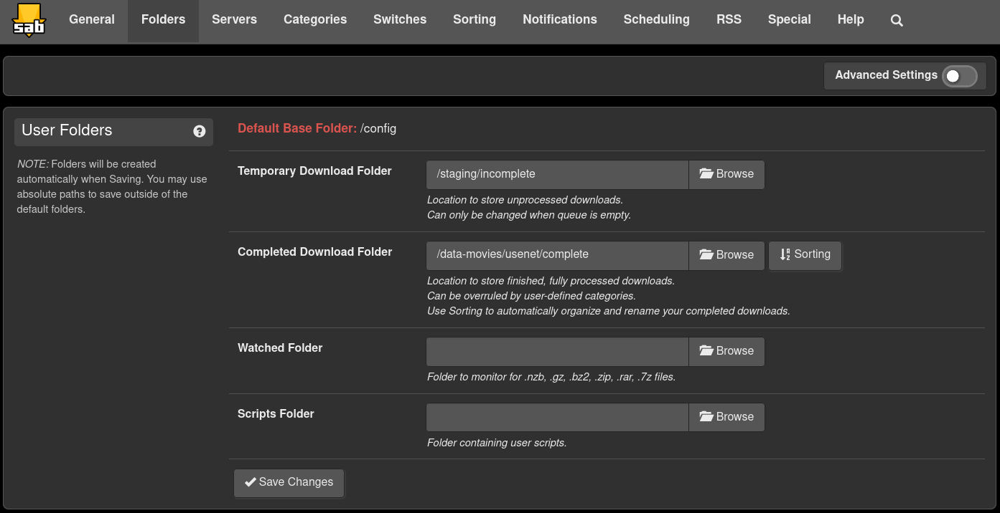

The Folders tab. The temporary folder is on the NVMe and the completed folder
is on the film disk. The free space limits, speed limit and switches are on
other tabs and are listed in the table above.

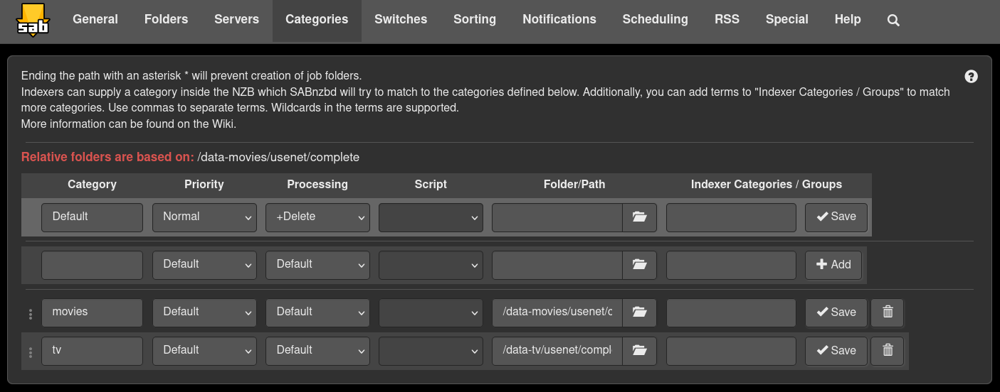

The Categories tab. The red line at the top is the default folder, which is the
film disk. The `tv` category overrides it with an absolute path on the WD disk.
Without that, every episode would land on the film disk and its import would
become a slow copy across disks instead of a hardlink.

## Prowlarr

Prowlarr holds the indexer and pushes it into Radarr and Sonarr, so it is
configured once.

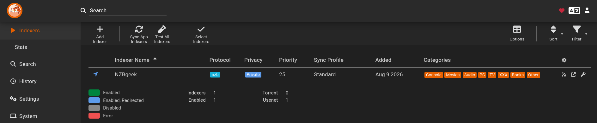

One Usenet indexer, NZBgeek. There is no proxy in front of it because it does
not need one.

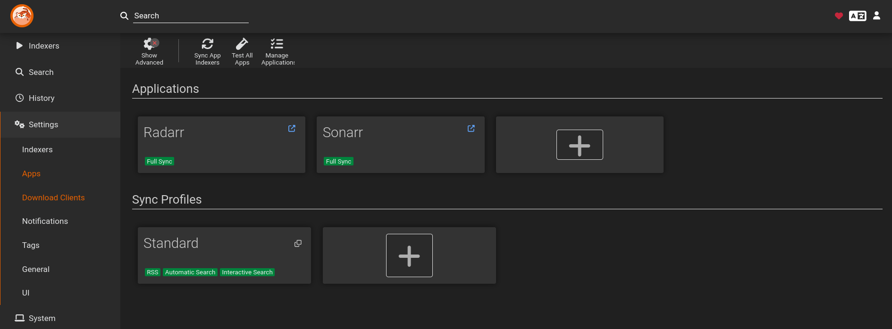

Radarr and Sonarr are both set to Full Sync. Adding or removing an indexer here
is the whole job. Neither app has an indexer entered by hand.

## Radarr and Sonarr

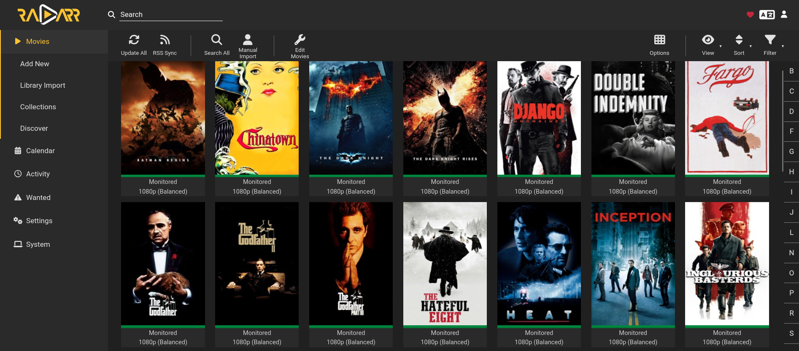

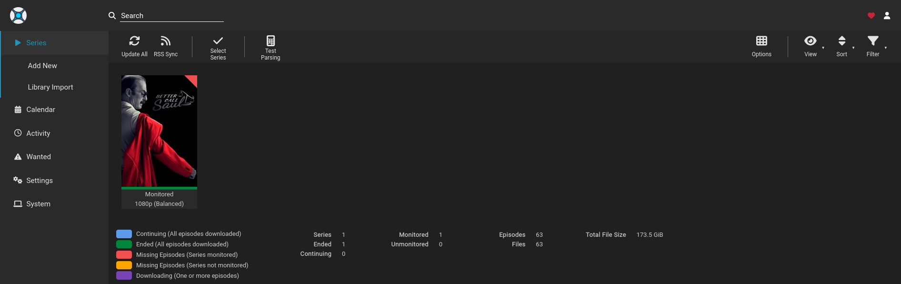

Both apps use one quality profile called `1080p (Balanced)`, and every title in
the library uses it. The final library is 117 films on 1.84 TB and 10 series
with 302 episodes on 916 GB.

| Setting | Radarr | Sonarr |
|---|---|---|
| Root folder | `/data/media/movies` | `/data/media/tv` |
| Allowed qualities | Bluray-1080p, WEBDL-1080p | one group: Bluray, WEBDL and WEBRip 1080p |
| Minimum custom format score | 0 | 1600 |
| Upgrade until score | 1600 | 1600 |
| Minimum score gain for an upgrade | 100 | 100 |
| Download client | SABnzbd, category `movies` | SABnzbd, category `tv` |
| Import lists | none | none |

The minimum gain of 100 means a small difference, such as a different audio
track, never starts a new download of a file that is already good.

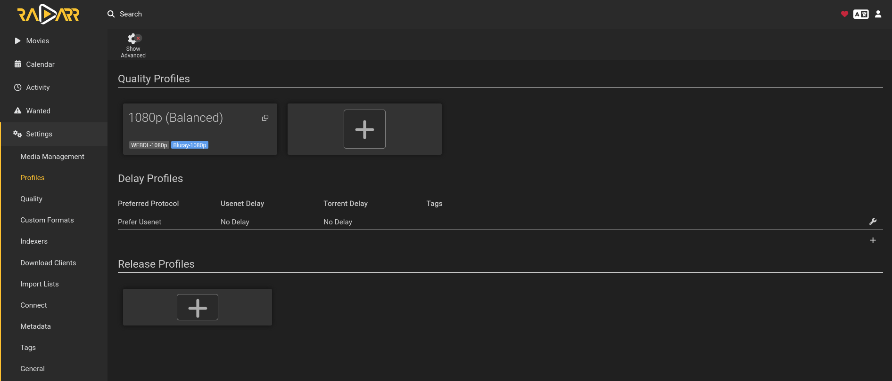

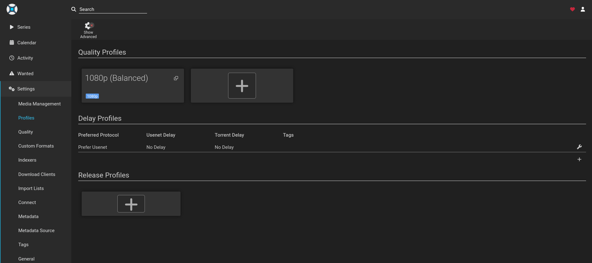

The profile cards show the one real difference between the two apps. Radarr's
card carries two quality tags. Sonarr's carries one group.

### Why Sonarr has one quality group

Radarr and Sonarr compare quality rank before they compare score. With Bluray,
WEB-DL and WEBRip as separate ranks, a badly encoded Bluray always beat a well
encoded WEB-DL, because the rank decided first and the scores were never
compared. The same happened one step down between WEB-DL and WEBRip.

Putting all three in one group removes the rank from the decision, so the score
decides. On Better Call Saul this took the share of episodes from a known good
release group from 26 of 53 to 53 of 53.

Radarr keeps two ranks because almost every film is a Bluray release, so the
problem does not appear there.

### Why the minimum score differs

A release from a ranked group can never score below 1725 in Sonarr. An
unranked release can never score above 97, which is the best audio plus a
repack. A minimum of 1600 sits in that empty gap and means "ranked groups
only". For series this is the right trade: one
weak episode in a good season is worse than a missing one that gets filled
later.

Radarr stays at 0. Films are one file per title, and a few older films exist
only from groups that are not on any list. A weaker file is better than no film.

### File size limits

Releases that are too large or too small for their runtime are rejected. The
values are megabytes per minute.

| Quality | Minimum | Preferred | Maximum |
|---|---|---|---|
| Radarr, WEBDL-1080p | 35 | 65 | 125 |
| Radarr, Bluray-1080p | 45 | 80 | 165 |
| Sonarr, WEBDL-1080p and WEBRip-1080p | 25 | 40 | 105 |
| Sonarr, Bluray-1080p | 30 | 45 | 120 |

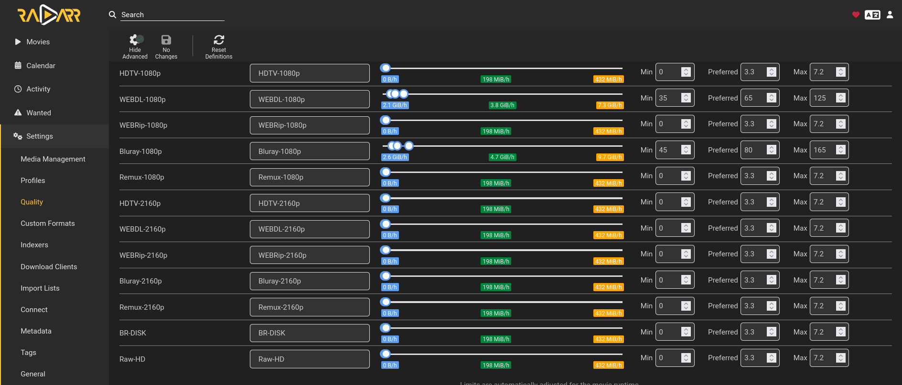

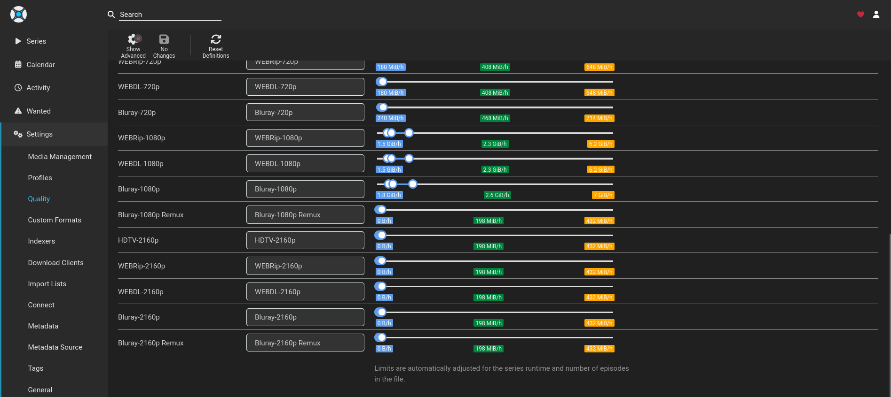

The Radarr page shows the values directly. The Sonarr page is scrolled, so only
the sliders are visible and the numbers are in the table.

The Radarr Bluray maximum is 165 because film grain is expensive to encode. A
good release of a 1970s film can need twice the bitrate of a modern one, and at
the old limit of 125 those releases were rejected. The preferred value stays low
on purpose. It is the last tie breaker, so between two releases with the same
score the smaller one wins.

The limit is checked against the size of the NZB, not the finished file. A
Usenet post also carries repair data, so the file on disk ends up about 15 to 20
percent smaller than the listed size.

Qualities outside the profile, such as Remux, still show a default maximum of
7.2. Nothing is ever measured against it.

These limits are set by hand. `recyclarr.yml` deliberately has no quality
definition block, because it would overwrite them.

### Media management

| Setting | Value | Why |
|---|---|---|
| Use hardlinks instead of copy | On | An import costs no time and no extra space |
| Import extra files | Off | Samples and text files stay out of the library |
| Delete empty folders | On | A removed title leaves nothing behind |
| Minimum free space on import | 10 GB, check on | Stops an import before a disk is completely full |
| Rescan folder after refresh | After manual refresh only | The daily metadata refresh does not wake a parked drive |
| Propers and repacks | Do not prefer | The score already covers repacks. The built-in logic overrides the score, and once refused five better releases for a file marked as a second revision. |
| Metadata files | none | Nothing writes NFO or artwork files to the hard drives |
| Recycle bin | none | |

Naming makes every file describe itself without a database:

| App | Format |
|---|---|
| Radarr file | `{Movie Title} ({Release Year}) {edition-{Edition Tags}} {Quality Full}` |
| Radarr folder | `{Movie Title} ({Release Year})` |
| Sonarr file | `{Series Title} - S{season:00}E{episode:00} - {Episode Title} {Quality Full}` |
| Sonarr folder | `{Series Title}/Season {season}` |

The edition token matters. Without it, a 208 minute extended cut and a 179
minute theatrical cut of the same film had identical file names. Jellyfin reads
the same token, so one change fixed both apps.

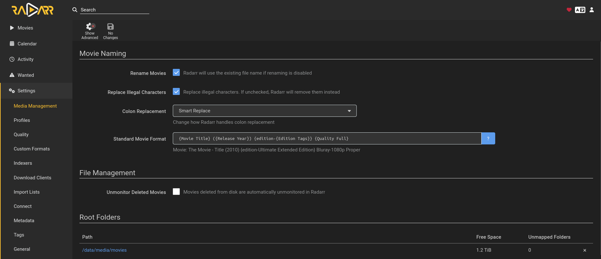

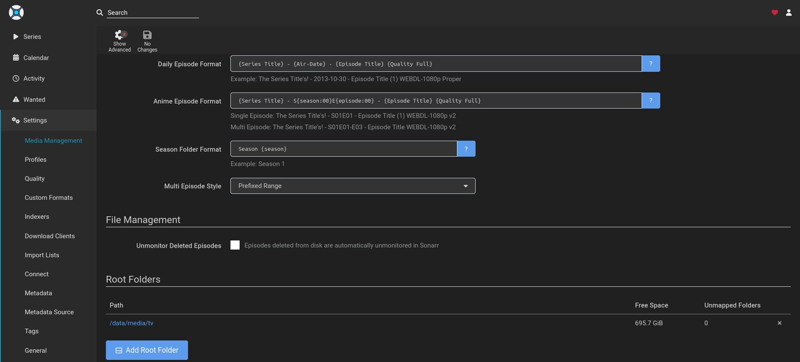

Both pages are shown with advanced settings hidden, which is how they open. The
settings that matter most here are behind that button, which is why they are in
the table above.

## Recyclarr and the scoring model

Recyclarr runs once a day and writes custom formats and their scores into
Radarr and Sonarr from [`recyclarr.yml`](recyclarr.yml). The formats come from
the TRaSH Guides. Radarr ends up with 38 of them and Sonarr with 35.

The model has three layers.

**1. Release group.** TRaSH ranks release groups by how well they encode. This
is the main signal.

| Tier | Radarr | Sonarr |
|---|---|---|
| WEB Tier 01 | 1700 | 1825 |
| HD Bluray Tier 01 | 1800 | 1800 |
| WEB Tier 02 | 1650 | 1775 |
| HD Bluray Tier 02 | 1750 | 1750 |
| WEB Tier 03 | 1600 | 1725 |
| WEB Scene | | 1725 |
| HD Bluray Tier 03 | 1700 | |

In Sonarr the WEB tiers are raised by 125 so that WEB and Bluray alternate:
a WEB release beats a Bluray release of the same tier, and Bluray stays as the
fallback when the WEB release is gone. The step between them is 25, below the
upgrade gain of 100, so this change never replaced a file already on disk.

**2. Audio.** Only one audio format matches per release, so audio adds one
number, not a sum.

| Format | Score |
|---|---|
| DD+ Atmos | 90 |
| DD+ | 85 |
| AAC | 80 |
| DD | 75 |
| Atmos, codec unknown | 60 |
| DTS-ES | 55 |
| DTS | 50 |
| DTS-HD HRA | 35 |
| DTS-HD MA | 30 |
| FLAC | 25 |
| PCM | 22 |
| TrueHD | 20 |
| DTS:X | 15 |
| TrueHD Atmos | 10 |
| Opus | 5 |
| MP3 | 2 |

Lossy formats score above lossless on purpose. TrueHD and DTS-HD MA force an
audio transcode on most remote clients and add 2 to 4 GB per film. Lossless is
still allowed. It just loses a tie.

The whole audio range is under 100, which is smaller than one tier step and
smaller than the upgrade gain. Audio can pick between two releases in the same
tier, but it can never beat a better tier and can never start a download on
its own.

**3. Rejections.** Unwanted formats score -10000: BR-DISK, LQ, upscaled, AV1,
extras, bad dual audio groups, and `x265 (HD)`, which catches HEVC below 4K.
At 1080p those are usually re-encodes of an existing encode.

The scores are positive everywhere else for a reason. An earlier version gave
unwanted audio -1000. With a minimum score of 0, a negative total is not a
lower priority, it is a rejection. The problem was the sign, not the size.

Two smaller tie breakers exist for repacks: Repack/Proper 5, Repack2 6,
Repack3 7.

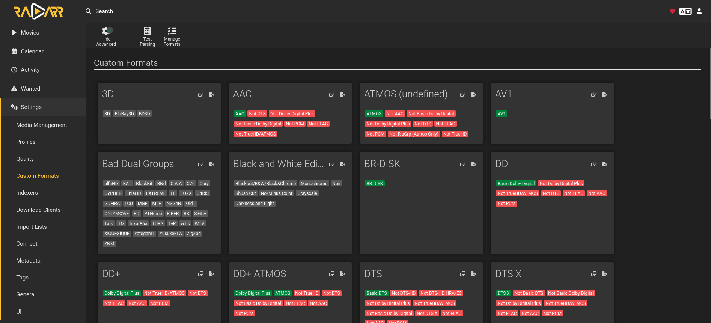

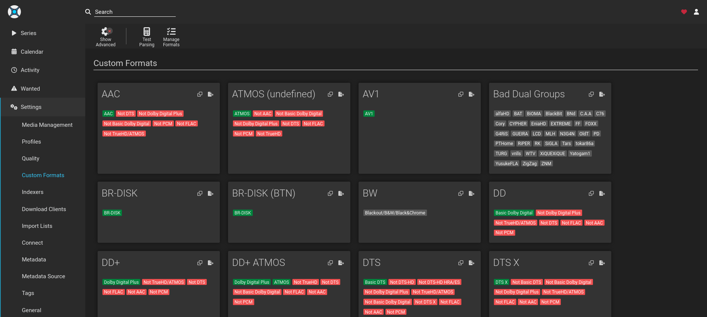

These pages show how each format recognises a release. Green terms must match
and red terms must not. The scores are not shown here. They live in the quality
profile and are listed in the tables above.

## Bazarr

Bazarr fetches subtitles and writes them next to the video file.

| Setting | Value | Why |
|---|---|---|
| Language profile | English only, assigned to every new title automatically | |
| Providers | OpenSubtitles.com, Subdl, Gestdown, Embedded Subtitles | One provider being down is not a problem |
| Treat embedded subtitles as downloaded | Off | Required by the embedded provider. Both on breaks extraction. |
| Minimum score, episodes | 90 | An episode match includes series, season and episode, so a weak match can be the wrong episode |
| Minimum score, films | 85 | |
| Sync below score, episodes | 95 | |
| Sync below score, films | 96 | |
| Excluded from sync | embedded subtitles | They come from the same file, so they are already in sync |
| Upgrade subtitles | On, for 7 days after download | |
| Encode to UTF-8 | On | |

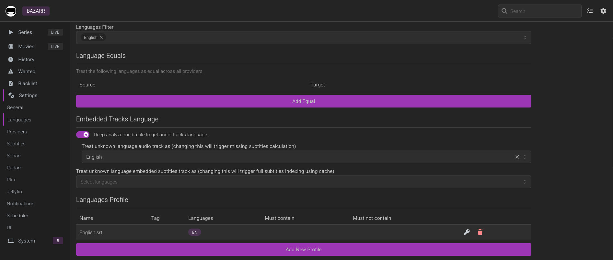

The Languages page. One profile, `English.srt`, with English as the only
language.

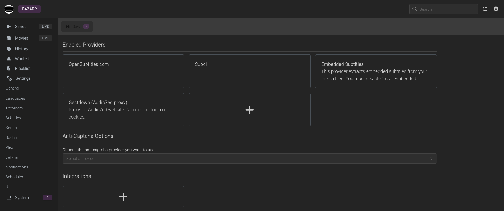

The four enabled providers. Embedded Subtitles does most of the work: it
extracts a text subtitle that is already inside the video file. A subtitle from
the same file cannot be out of sync and cannot belong to a different release.
The cost is a full read of the file, once, right after import while the drive is
awake anyway.

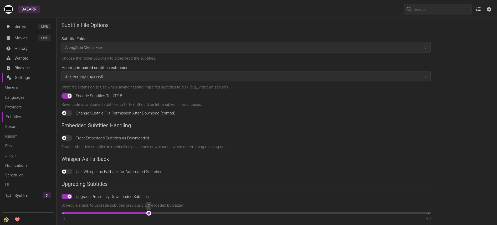

Subtitles are written alongside the media file and converted to UTF-8.
Treat Embedded Subtitles as Downloaded is off, which the embedded provider
needs. Upgrades run for 7 days after a subtitle arrives.

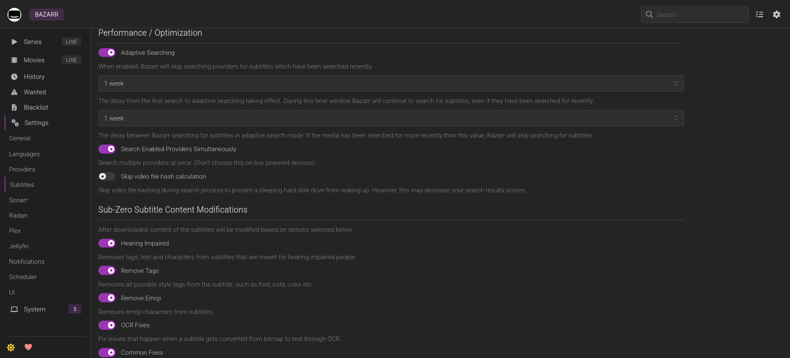

Skip video file hash calculation is left off. The hash gives a much more
reliable match, and the option only exists to avoid waking a sleeping drive.
Here the file is read right after import, while the drive is already spinning.

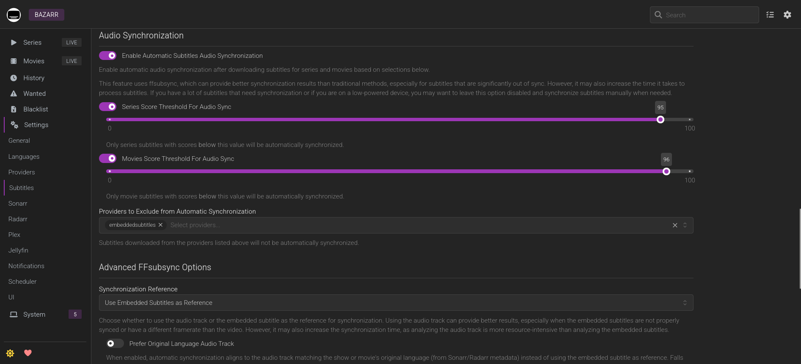

Audio sync thresholds: 95 for episodes and 96 for films, with the embedded
provider excluded. The film threshold was raised from 90 after three subtitles
arrived just above 90 and stayed out of sync.

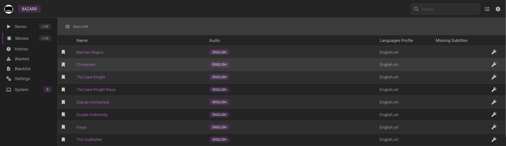

Every film has the `English.srt` profile and the Missing Subtitles column is
empty. In the final library all 117 films and all 302 episodes have a subtitle.

## Jellyfin

| Setting | Value | Why |
|---|---|---|
| Hardware acceleration | Intel Quick Sync, `/dev/dri/renderD128` | Measured at 14.8 times real time for a full 1080p encode |
| Hardware decoding | H.264, HEVC, HEVC 10-bit, VP9, AV1 | |
| AV1 encoding | Off | This iGPU can decode AV1 but not encode it |
| Throttle transcodes | On, 180 seconds ahead | See below |
| Delete segments | On, keep 12 minutes | The built-in cleanup task does not delete them |
| Embedded subtitles | None, on both libraries | See below |
| Real time monitoring | On | New files appear without a scan |
| Chapter images, trickplay, keyframes | Off | Each reads every file end to end |
| Save metadata next to media | Off | Nothing is written to the media drives |
| Scheduled tasks | 03:00 daily, or no trigger | See below |

### Libraries

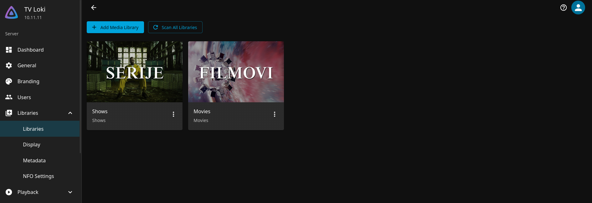

Two libraries, one per disk. Series point at `/data/media/tv` and films at
`/data/media/movies`, both mounted read-only.

### Embedded subtitles are hidden on purpose

Bluray releases often carry image subtitles such as PGS. An image subtitle
cannot be sent as text. It has to be burned into the picture, and that forces a
full video transcode even when the video and audio could play directly.

With embedded subtitles set to None, Jellyfin never offers those tracks. The
text `.srt` file from Bazarr is the only subtitle, and it is sent as a separate
track. In playback, an episode with 10 embedded subtitle tracks started ffmpeg
with all of them excluded and copied the video without re-encoding.

### Throttling fixed stuttering playback

Without throttling, ffmpeg transcoded as fast as the hardware allowed. Two
browser sessions ran at 63 and 73 times real time, held the Toshiba drive at
120 MB/s for four minutes and wrote 23 GB of temporary segments. The playback
stuttered because the drive was saturated. With throttling on, ffmpeg stays 180
seconds ahead of the viewer and reads about 2 MB/s.

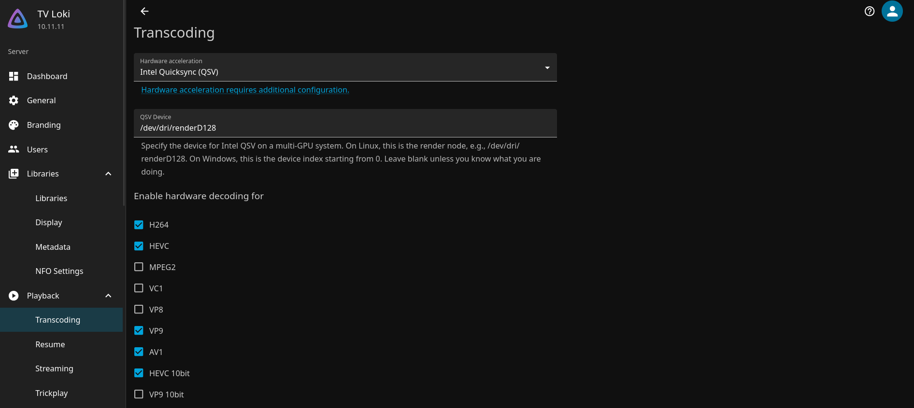

The top of the Transcoding page: Quick Sync on the render device and the codecs
it decodes in hardware. Throttling, segment deletion and the encoder options are
further down the same page.

### What playback looks like

| Client | Result |
|---|---|
| Android TV | Direct play, ffmpeg not started |
| Android phone | Direct play |
| Browser | Video copied, audio converted to stereo AAC, because browsers do not play MKV or AC3 |
| Browser with a bitrate cap | Real hardware encode on the iGPU |

### Playback defaults for every user

| Setting | Value | Why |
|---|---|---|
| Preferred audio language | English | Some dual-audio releases mark the other language as default |
| Play default audio track | Off | Lets the language preference win over that flag |
| Subtitle language | English | |
| Subtitle mode | Smart | Subtitles turn on for foreign audio only, and stay off for English audio |

Smart mode only behaves like this when the subtitle language is set. With the
language empty it turned subtitles on for everything.

Every account locks after 3 failed logins. The admin account cannot sign in
from outside the LAN.

### Scheduled tasks

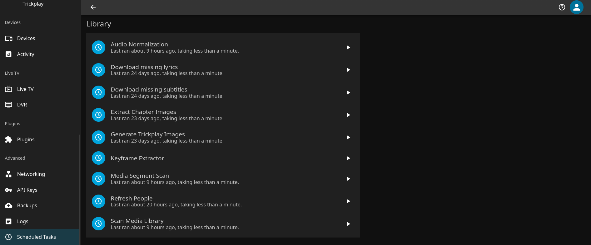

Every task that runs on a schedule runs once a day at 03:00, or weekly at
03:00 for the TVDB plugin. The rest have no trigger at all. Chapter images,
trickplay and the keyframe extractor stay that way, because each one reads the
whole library.

This page shows how long each task took, not its schedule. Every task finishes
in under a minute. The heavy work already happened at import, while the drive
was awake, so the nightly run finds nothing left to do. The same 03:00 slot is
used by the host's SMART read, so the drives wake once for all of it.

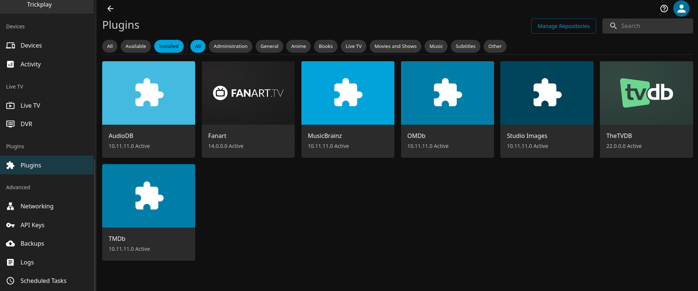

The installed plugins are metadata providers only. None of them opens a video
file.

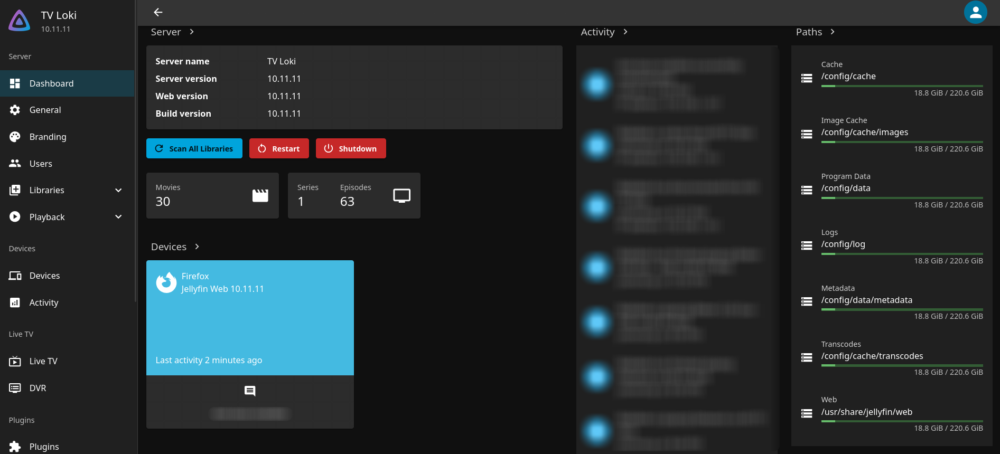

Every working path is under `/config`, which is on the NVMe. Cache, metadata
and transcode segments never touch a media drive.

### Behind the tunnel

Jellyfin runs behind Cloudflare Tunnel, so every remote request reaches it from
the `cloudflared` container.

| Setting | Value | Why |
|---|---|---|
| Known proxies | `172.18.0.0/16`, the Docker network | Jellyfin reads the real client address from the forwarded header, so lockout and logs see the real client |
| Published server address | public hostname for external clients, LAN address for local ones | A client is told the address it can actually reach |
| Local network addresses | empty | A value of `::` left Jellyfin with no usable interface, and clients were handed `http://[::1]:8096` |

## Where it runs out

**Disk space.** Both media drives are 99 percent full. SABnzbd and both apps
stop at 10 GB free, so nothing new is imported until something is removed. The
library is meant to rotate.

**One Usenet provider.** During the fills, 47 percent of grabs failed, almost
all because the articles had been removed from the provider. Automatic retry
found another release for most of them. The fix would be a second provider on
a different backbone. It was never bought.
